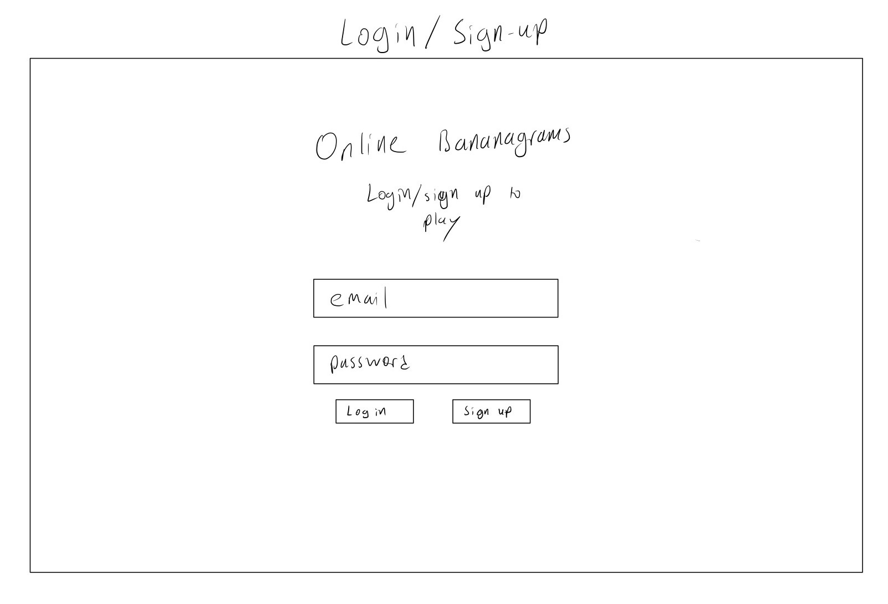
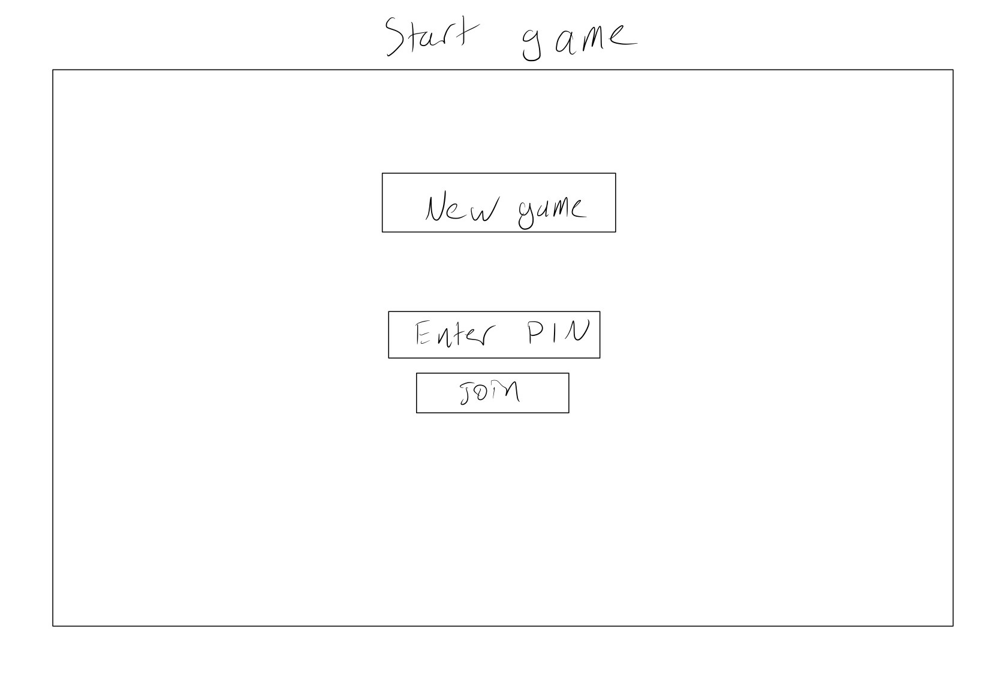
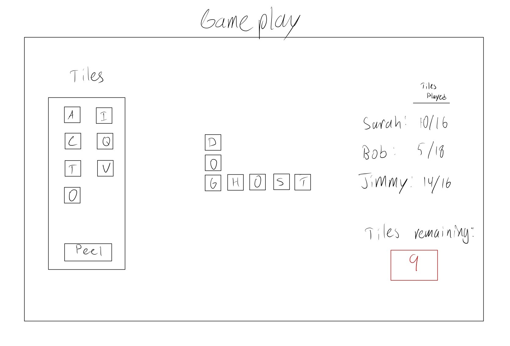
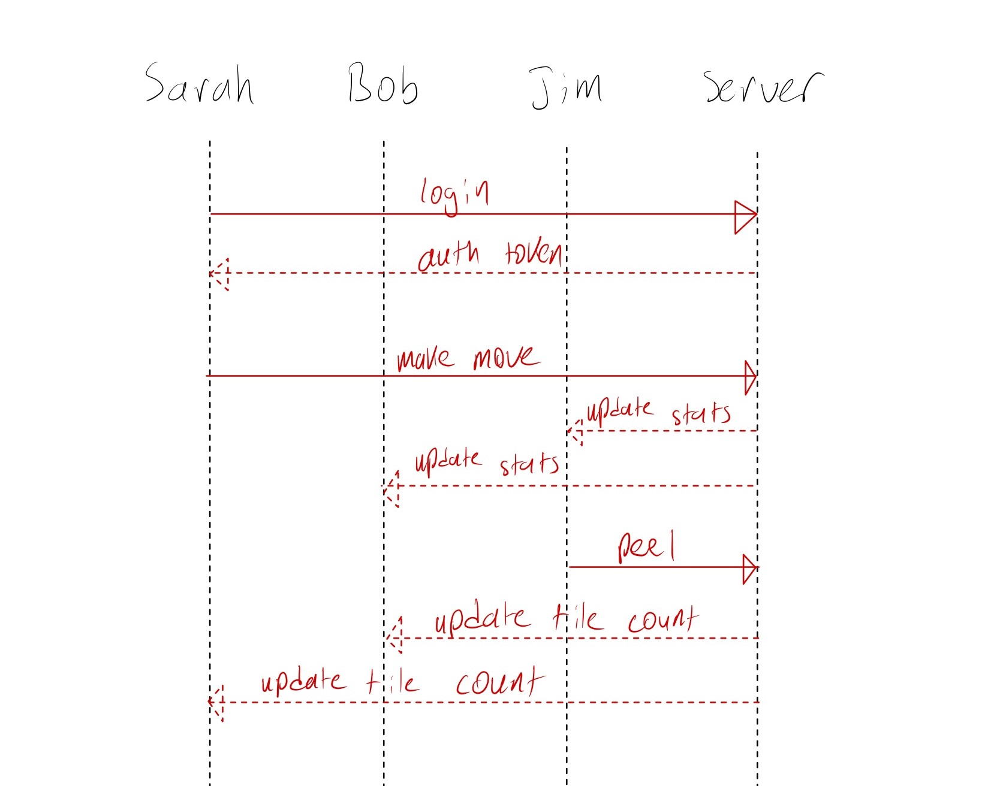

For course notes, see [notes.md](notes.md)

# WordBlitz

## Specification Deliverable

### Elevator Pitch
Do you love the family-favorite game Scrabble but wish it was more fast paced? WordBlitz is for you! Each person uses their letters to make their own combination of words, and the first person to use all of their tiles wins. The physical game is fun, but this online version gives you a chance to beat your dad even if he lives across the country! 

Can you tell I'm a little competitive with my dad?

### Design 

Interaction with backend:

### Key Features
- Login/register over HTTPS
- Start new game or join using add code
- Does not allow invalid moves
- Ability to "peel" (return one tile for three more)
- Progress of each player displayed in realtime
- Number of remaining tiles displayed in realtime
- See your own stats (number of wins, highest scoring game)
    - Note that scoring is not a part of the original game. The site will score the player's final baord using offical scrabble scoring. 

### Technologies
This is how I plan to use each of the following technologies:
- **HTML** - Used to create well-structured web pages, including a page for login, joining a game, playing a game, and seeing a user's stats. 
- **CSS** - Used to make each page look professional on varying screen sizes. This will also be used for the animation on the page (sliding tiles, etc.)
- **JavaScript** - Provides login, creating a game, joining a game, moving tiles, and any other logic necessary for gameplay. 
- **Service** - Backend provides endpoints for loging in/registering, creating/joining a game, "peeling", and getting a new tile when a user finishes a round. 
- **DB/Login** - Users must register/login before playing. This connects to a database to persist username, passwords, and stats (number of wins, highest score, etc)
- **WebSocket** - As each user plays, other users are updated on their status. This is also used to maintain a current count of tiles remaining. 